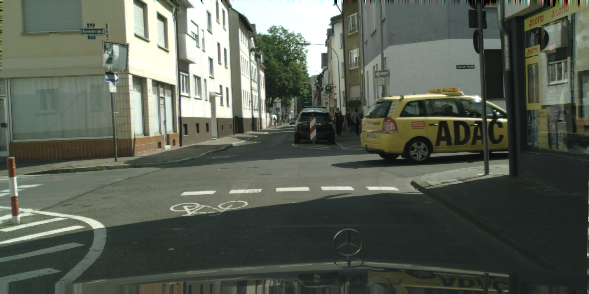

# All-Weather Driving Segmentation (Cityscapes → ACDC)

**Robust semantic segmentation for autonomous driving in bad weather**  
**Model:** DeepLabV3+ (ResNet-101) · **Train:** Cityscapes · **Eval:** ACDC (fog / night / rain / snow)  
**Extras:** Weather-aware data augmentation, test-time BN adaptation (TTA), per-condition analysis, image & video demos

<p align="center">
  
  
  <br/>
  <em>Left: input frame · Middle: predicted mask · Right: overlay</em>
</p>

<p align="center">
  ▶ <a href="demo_outputs/acdc_demo_triptych.mp4">Demo video: ACDC triptych (input | segmentation | overlay)</a>
</p>

---

## Why this project matters

Self-driving cameras struggle when there’s **fog, rain, snow or at night**. If the model can’t correctly tell **road vs. sidewalk vs. cars vs. people**, you get unsafe behavior.  
This repo shows how to:

- **Train** a strong segmentation model on a clean, sunny dataset (Cityscapes),
- **Generalize** to tough conditions (ACDC) with and without **weather augmentations**, and
- **Adapt at test time** (BN-Adapt) so the model “re-calibrates” to the scene distribution it’s currently seeing.

---

## Results


### Overall ACDC (val)

| Training recipe | ACDC mIoU (zero-shot) | ACDC mIoU + BN-Adapt (iters=1) |
|---|---:|---:|
| **Baseline** (Cityscapes only) | **0.83** | **0.95** |
| **WeatherAug** (Cityscapes + heavy weather augs) | 0.62 | 0.61 |

### Per-condition ACDC (val)

| Model | Fog | Night | Rain | Snow |
|---|---:|---:|---:|---:|
| **Baseline (CS only)** | 0.68 | **0.87** | **0.90** | 0.77 |
| **WeatherAug** | 0.66 | 0.52 | 0.77 | **0.82** |


---

## 📦 Datasets (public)

- **Cityscapes** (train/val; `leftImg8bit` + `gtFine` with `labelTrainIds`)  
  https://www.cityscapes-dataset.com/
- **ACDC (Adverse Conditions Dataset)** (fog / night / rain / snow)  
  https://acdc.vision.ee.ethz.ch/

> You must register to download. Please respect licenses.

---

## Repo structure

```
src/
  augments.py
  datasets.py
  train_baseline.py
  eval_acdc.py
  tta_bn_adapt.py
  infer.py
  make_demo_video.py
scripts/
  make_filelists.py
  plot_metrics.py
assets/
  street.png
  street_mask.png
  street_overlay.png
  acdc_demo_triptych.mp4
runs/
  ...
dataset/
  Cityscapes_clean/
  ACDC/
```
---

## 🧰 Prerequisites & setup

- Python ≥ 3.10, CUDA-enabled PyTorch, NVIDIA GPU (A100/RTX recommended)
- Linux shell (`bash`), Git, **Git LFS** (for `.pth` and `.mp4`)

First, clone the repository and enter the project folder:
```bash
git clone https://github.com/oaphyapran365/AllWeatherDriveSeg.git
cd AllWeatherDriveSeg

```
---

## Quickstart

### 0) Environment
```bash
python -m venv env/.venv
source env/.venv/bin/activate

pip install --upgrade pip
pip install -r requirements.txt
```

### 1) Dataset layout

```
dataset/
  Cityscapes_clean/
    leftImg8bit/{train,val}/<city>/*.png
    gtFine/{train,val}/<city>/*_gtFine_labelTrainIds.png
  ACDC/
    rgb_anon/{fog,night,rain,snow}/{train,val,test}/...
    gt_trainval_ref/{fog,night,rain,snow}/{train_ref,val_ref}/...
```

Generate pairlists:

```bash
python scripts/make_filelists.py
```

### 2) Train (Cityscapes baseline)

```bash
export CUDA_VISIBLE_DEVICES=0
PYTHONPATH=src python src/train_baseline.py \
  --train_pairs dataset/cityscapes_train_pairs.txt \
  --val_pairs   dataset/cityscapes_val_pairs.txt \
  --out runs/cs_deeplabv3p_r101_e80 \
  --bs 8 --epochs 80 --workers 8
```

### 3) Evaluate on ACDC

```bash
PYTHONPATH=src python src/eval_acdc.py \
  --pairs dataset/acdc_val_pairs.txt \
  --ckpt  runs/cs_deeplabv3p_r101_e80/best.pth \
  --bs 2 --workers 4 --pad_h 1088 --pad_w 2048
```

Per-condition eval:

```bash
for C in fog night rain snow; do
  grep "/rgb_anon/${C}/val/" dataset/acdc_val_pairs.txt > dataset/acdc_val_${C}_pairs.txt
  PYTHONPATH=src python src/eval_acdc.py \
    --pairs dataset/acdc_val_${C}_pairs.txt \
    --ckpt runs/cs_deeplabv3p_r101_e80/best.pth \
    --bs 2 --workers 4 --pad_h 1088 --pad_w 2048
done
```

### 4) BN-Adapt

```bash
PYTHONPATH=src python src/tta_bn_adapt.py \
  --pairs dataset/acdc_val_pairs.txt \
  --ckpt runs/cs_deeplabv3p_r101_e80/best.pth \
  --iters 1 --bs 4 --workers 4 --pad_h 1088 --pad_w 2048
```

### 5) Weather-aug training (optional)

```bash
PYTHONPATH=src python src/train_baseline.py \
  --train_pairs dataset/cityscapes_train_pairs.txt \
  --val_pairs   dataset/cityscapes_val_pairs.txt \
  --out runs/cs_weatheraug_deeplabv3p_r101_e80 \
  --bs 8 --epochs 80 --workers 8 --robust
```

### 6) Inference

**Single image → mask + overlay**
```bash
PYTHONPATH=src python src/infer.py \
  --ckpt runs/cs_deeplabv3p_r101_e80/best.pth \
  --input assets/street.png \
  --out assets/ \
  --pad_h 1088 --pad_w 2048 --overlay_alpha 0.5
```

**Video file → overlay video**  
(`infer.py` supports videos; or use `src/make_demo_video.py` for a triptych with FPS HUD)
```bash
PYTHONPATH=src python src/infer.py \
  --ckpt runs/cs_deeplabv3p_r101_e80/best.pth \
  --input assets/acdc_demo_triptych.mp4 \
  --out assets/acdc_demo_triptych_overlay.mp4 \
  --pad_h 1088 --pad_w 2048
```


---

## Acknowledgments

* Cityscapes / ACDC authors for datasets.
* [segmentation_models_pytorch](https://github.com/qubvel/segmentation_models.pytorch)
* [Albumentations](https://albumentations.ai/)
